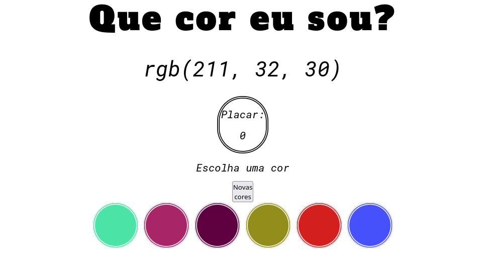

# Projeto Trybe - Color Guess

Nesta aplicação é possível jogar um jogo de adivinhação de cores e sua pontuação é atualizada de acordo com os acertos.

#### Habilidades desenvolvidas no projeto:

- Manipular o DOM.
- Manipular o Javascript.
- Manipular o CSS.

#### Print da aplicação:

